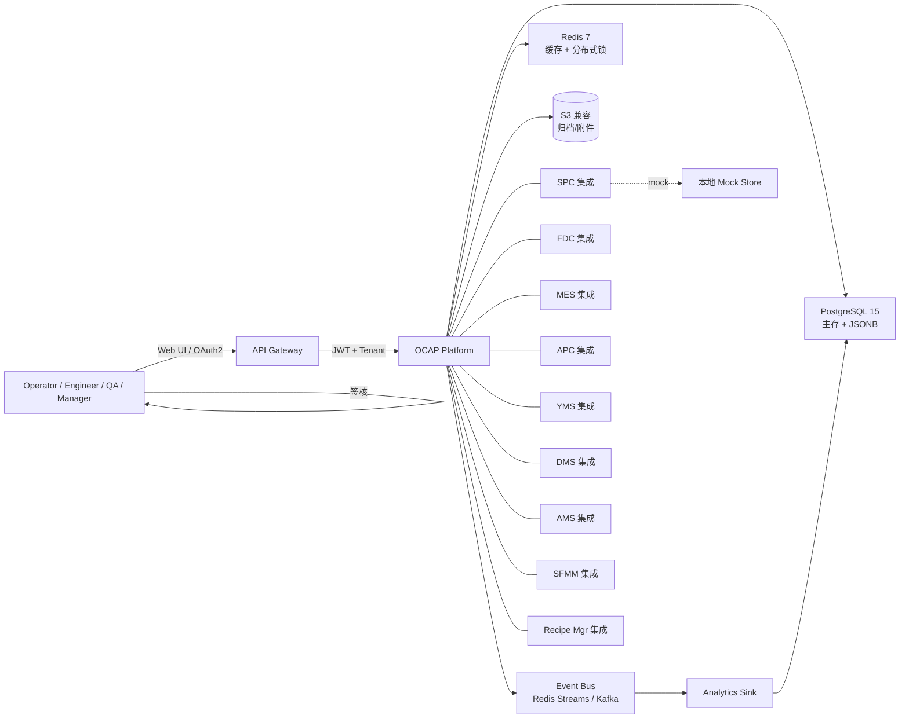
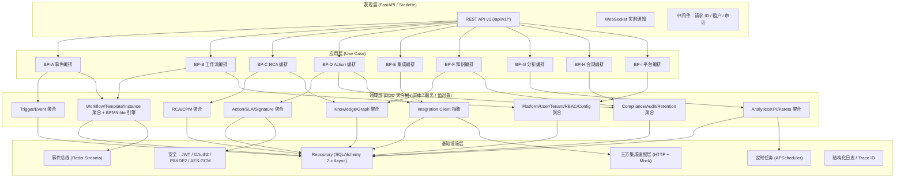

# OCAP 概要设计文档（High-Level Design）

> 版本：1.0 | 目标：半导体 Fab 异常失控行动计划系统（Out-of-Control Action Plan, OCAP）
> 架构风格：领域驱动设计（DDD）分层 + 嵌入 BPMN-lite 工作流 + 事件驱动 + 合规审计

---

## 1. 设计目标与对标

对标业界领先的制造异常闭环平台（如 Applied Materials APF、KLA Tencor iOCAP、Lam Research DBS、Tokyo Electron PDM）：

| 能力维度 | 业界基准 | 本设计目标 |
| --- | --- | --- |
| 响应时延 SPC/FDC 报警 → 事件创建 | ≤ 10s（95 分位） | ≤ 10s |
| 工作流节点推进 P95 | ≤ 2s | ≤ 2s |
| RCA 推荐命中率 Top-1 | ≥ 65% | ≥ 70%（CPM 上下文模式匹配 + 知识图谱） |
| 批次处置 21 CFR Part 11 合规 | 电子签名 + 不可篡改链 | Hash 链 + 审计链双链 |
| 数据保留期 | ≥ 7 年 | ≥ 10 年（归档策略） |
| 年可用率 | ≥ 99.9% | ≥ 99.95% |
| 同时运行 OCAP 流程数 | 5,000 | 10,000 |

## 2. 核心业务点（Business Points）

见 [BUSINESS_POINTS.md](../BUSINESS_POINTS.md)，共 9 个业务点：

- BP-A 异常触发与事件管理（Triggers / Event）
- BP-B 工作流编排（Workflow，嵌入 BPMN-lite）
- BP-C 根本原因分析 RCA（CPM / FiveWhy / Fishbone / 8D）
- BP-D 行动计划执行（Action + SLA + 电子签核）
- BP-E 三方系统集成（MES / SPC / FDC / APC / YMS / DMS / AMS / SFMM / Recipe）
- BP-F 知识管理（Case 库 + 审核 + 知识图谱）
- BP-G 分析与报告（KPI / Pareto / G2G / 8D / 仪表盘）
- BP-H 合规与审计（审计日志 / 电子记录 / 保留期）
- BP-I 平台与通用能力（租户/用户/角色/权限/通知/导出/配置）

## 3. 系统上下文图（C4 Level-1）

## 4. 总体架构分层（C4 Level-2 + DDD 分层）

## 5. 技术选型

| 层次 | 技术 | 说明 |
| --- | --- | --- |
| 语言 | Python 3.12+ | PEP 695 泛型 / match-case |
| Web 框架 | FastAPI 0.110 + Starlette | Async + 自动 OpenAPI |
| ORM | SQLAlchemy 2.x Async Session | Alembic 迁移 |
| 主存 | PostgreSQL 15 | JSONB / BRIN / 分区表 |
| 测试库 | SQLite :memory: + StaticPool | 单测 0 外部依赖 |
| 缓存/锁/流 | Redis 7 | Redlock / Streams |
| 安全 | python-jose + passlib[bcrypt] + JWT RS256 | PBKDF2 密码 |
| 调度 | APScheduler AsyncIOScheduler | KPI 聚合 / 保留期归档 |
| 文档 | Mermaid 嵌入 Markdown | 可渲染图 |
| 测试 | pytest + pytest-asyncio + httpx.AsyncClient | Fixture 模式 |
| 部署 | Uvicorn + Gunicorn + 系统单元 | macOS launchd |

## 6. 聚合根与一致性边界

| 聚合根 | 主表 | 一致性边界 |
| --- | --- | --- |
| Event | `events` + `event_relations` + `anomaly_attributes` | 事件闭环在聚合内一致 |
| WorkflowTemplate | `workflow_templates` | 模板版本号乐观锁 |
| WorkflowInstance | `workflow_instances` + `workflow_steps` | 节点推进在聚合内串行 |
| RCA | `rca_records` + `rca_recommendations` | RCA 结论不可变字段 |
| Action | `actions` + `action_signatures` + `execution_logs` | 签名哈希链自洽 |
| KnowledgeCase | `knowledge_cases` + `case_relations` + `case_reviews` | 发布后不可变 |
| KpiSnapshot | `kpi_snapshots` (分区) | 写入幂等（唯一键） |
| AuditLog | `audit_logs` (分区 + Hash 链) | 只追加不可改 |
| User / Tenant / Role | tenants / users / roles / permissions | RBAC 表 |

## 7. 事务边界

- 单次 API 调用 → 1 个聚合根变更 + 1 个工作单元（Unit of Work）
- 跨聚合根通过 **Event Bus Outbox**：先写 `outbox_events` 表，再异步投递，保证最终一致
- 电子签名 Hash 链、审计 Hash 链：严格串行顺序写

## 8. 可靠性与可观测性

- 重试：HTTP 三方集成 `tenacity`（指数退避 + 断路器）
- 幂等：关键写 API 支持 `Idempotency-Key` 头
- Trace：`request_id` 贯穿日志 / 审计 / 响应头
- 指标：Prometheus 风格 `/metrics`（可选暴露）
- 健康：`/healthz` `/readyz`

## 9. 非功能需求汇总

见 [06-performance-capacity.md](./06-performance-capacity.md)

- P95 事件创建：≤ 200 ms
- P95 节点推进：≤ 2 s
- P95 CPM 推荐：≤ 500 ms（10000 案例）
- 年可用：≥ 99.95%
- RPO：≤ 15 min（WAL 归档）
- RTO：≤ 30 min
