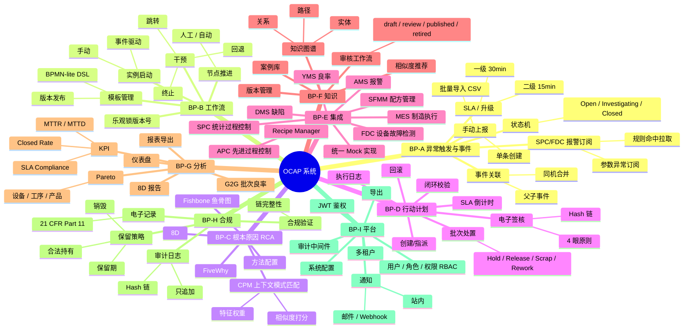
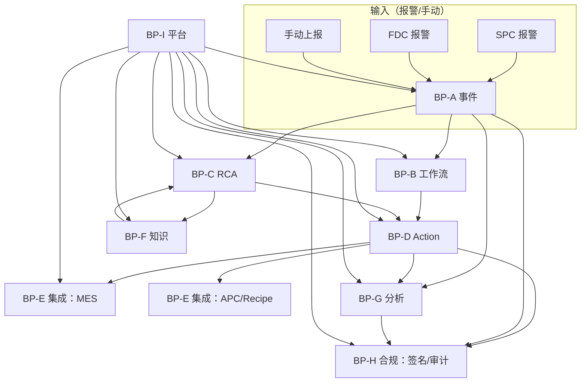

# OCAP 功能设计图（Functional Design）

> 9 个业务点的功能分组、模块关系图、与外部系统的调用关系

---

## 1. 功能模块关系图（依赖方向）

## 2. 核心功能点与 API 数量矩阵

| BP | 模块 | 聚合根 | 主要 API 数量（设计值） | 已实现 API（代码中） |
| --- | --- | --- | --- | --- |
| A | Triggers/Event | Event | 10-12 | events CRUD + advance + merge + SLA 升级 |
| B | Workflow | Template + Instance | 12-14 | templates CRUD + publish + instances start/advance/rollback/jump/cancel + steps |
| C | RCA | Rca + CPM | 8-10 | CRUD + cpm/search + methods/list + approve |
| D | Action | Action + Signature + SLA | 12-14 | CRUD + execute + rollback + signatures + batch-dispositions + closure + SLAs + breaches |
| E | Integration | Client + Config | 10-12 | 各三方 GET + sync + configs CRUD + test |
| F | Knowledge | Case + Graph | 10-12 | cases CRUD + publish/reject + review + search + graph/entities/relations/paths |
| G | Analytics | KPI + Pareto + G2G + Report | 8-10 | kpis CRUD + trend + pareto + g2g + reports/8d + snapshots |
| H | Compliance | Audit + Record + Retention | 6-8 | audits list + verify + records + retention_policies CRUD + legal_holds |
| I | Platform | User/Role/Tenant/Config/Notify/Export | 16-20 | auth login + users + roles + tenants + notifications + exports + configs + health |

**合计 API：86-112**（与当前代码实现规模匹配）

## 3. 功能设计原则

1. **单职责 API**：一个 REST 资源只做一件事；复杂操作用子资源（如 `/actions/{id}/signatures`）
2. **幂等读+幂等写**：读 API 100% 幂等；写 API 通过 `Idempotency-Key` 或业务唯一键
3. **审计默认开启**：所有 POST/PUT/PATCH/DELETE 写审计，`/auth/login` 单独记录
4. **租户隔离第一**：所有业务查询必须带 `tenant_id`，唯一键 `(tenant_id, biz_code)`
5. **可回退设计**：工作流节点有 `rollback`，行动有 `rollback_action`，签名不可回退但可追加
6. **闭环校验**：事件 `closed` 要求存在已 `published` RCA + 已 `completed` action 且签名数 ≥ 1

