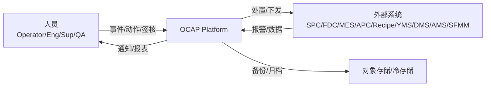
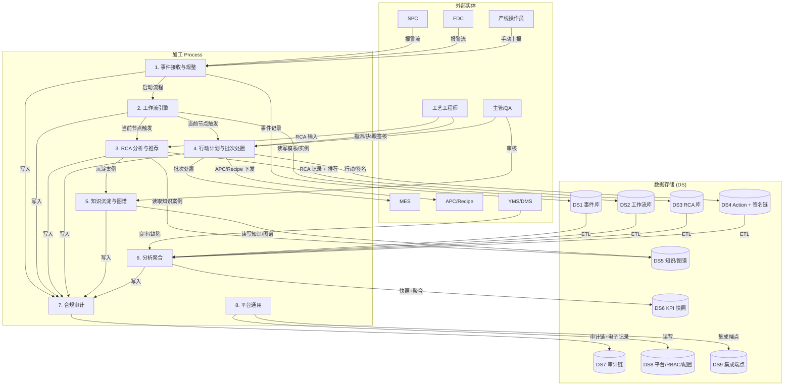
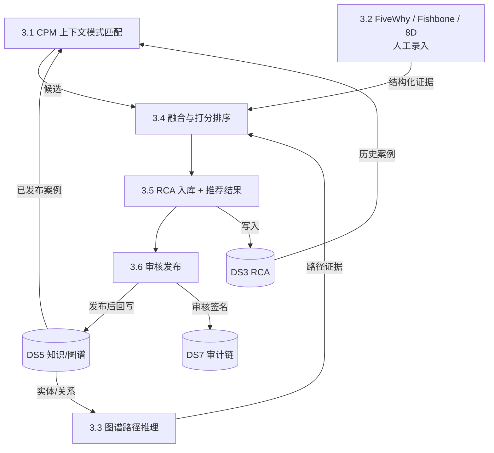
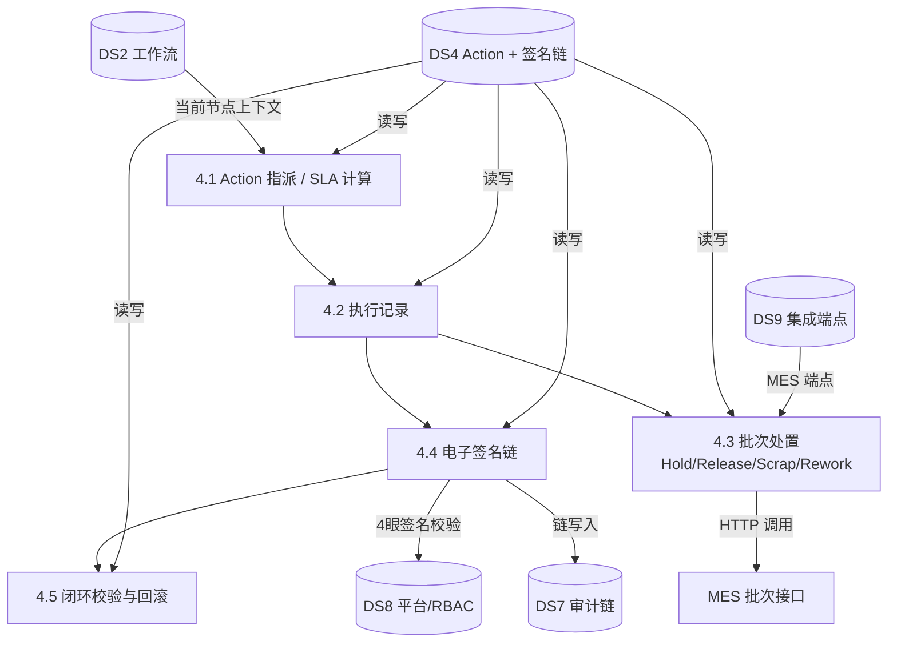

# OCAP 数据流图（Data Flow Diagram, DFD Level-0/1/2）

## DFD Level-0 — 系统上下文

## DFD Level-1 — 主要加工与数据存储

## DFD Level-2 — 3 号加工：RCA + 知识推荐（放大）

## DFD Level-2 — 4 号加工：Action + 签名链 + 批次处置（放大）

---

## 核心数据项流转汇总

| 数据项 | 来源加工 | 去向加工 | 主存储 | 生命周期 |
| --- | --- | --- | --- | --- |
| 原始报警 | SPC/FDC → 1 | 1, 2 | DS1 | 7 年在线 + 归档 |
| 异常事件（归一化） | 1 | 2, 3, 4, 6, 7 | DS1 | 10 年 |
| 工作流实例快照 | 2 | 2, 7 | DS2 | 10 年 |
| RCA 证据与结论 | 3 | 4, 5, 7 | DS3 | 10 年 |
| 行动计划 | 2, 3, 4 | 4, 7 | DS4 | 10 年 |
| 电子签名链 Hash | 4_4 | 7, 4_5 | DS4 + DS7 | 永久保留（21 CFR Part 11） |
| MES 批次处置结果 | 4_3 | 4, 7 | DS4（log） | 5 年 |
| 知识案例（草稿/发布） | 3, 5 | 3, 5 | DS5 | 永久 |
| 知识图谱实体/关系 | 5 | 3_3, 5 | DS5 | 永久 |
| KPI 快照（聚合） | 6 | 6, UI | DS6（分区表） | 日 1 年 / 月 5 年 |
| 审计记录（Hash 链） | 7（所有写） | 7 | DS7（分区表） | 永久 |
| 用户/RBAC/配置 | 8 | 1-8 各加工 | DS8 | 永久 |
| 集成端点配置 | 8 | 4_3 等集成调用 | DS9 | 永久 |
