# OCAP 数据库表与视图设计（Logical + Physical）

> 共 57 张表 + 若干统计视图；按领域分组，所有表默认带 `id bigserial PK`、`tenant_id bigint`、`created_at / updated_at timestamptz` 审计四件套（通过 mixin）。
> 多租户唯一键模式：`UNIQUE (tenant_id, business_code)`。
> 跨库兼容：JSONB 通过 `JSONBCompat`（PG=JSONB，SQLite=JSON TEXT）。

---

## 1. 领域 ER 总览（Mermaid ER）

```mermaid
erDiagram
    tenants ||--o{ users : "has"
    roles ||--o{ role_permissions : "contains"
    permissions ||--o{ role_permissions : "granted"
    users ||--o{ user_roles : "holds"
    roles ||--o{ user_roles : "assigned"

    trigger_rules ||--o{ trigger_rule_versions : "has"
    trigger_rules ||--o{ ocap_events : "created_by"
    ocap_events ||--o{ event_dedup_windows : "buckets"

    workflow_templates ||--o{ workflow_template_versions : "versioned"
    workflow_templates ||--o{ workflow_instances : "instantiated"
    workflow_instances ||--o{ workflow_nodes : "has_nodes"
    workflow_instances ||--o{ workflow_transitions : "has_transitions"
    workflow_instances ||--o{ workflow_interventions : "intervened"
    workflow_instances ||--o{ workflow_node_timeouts : "timeouts"

    ocap_events ||--o{ rca_records : "analyzed"
    rca_records ||--o{ rca_five_why : "uses_5why"
    rca_records ||--o{ rca_fishbone : "uses_fishbone"
    rca_records ||--o{ rca_fta : "uses_fta"
    rca_records ||--o{ rca_data_correlations : "correlations"
    rca_records ||--o{ cpm_runs : "cpm_runs"
    rca_records ||--o{ repeat_detections : "repeat_detect"

    ocap_events ||--o{ actions : "triggered"
    actions ||--o{ action_executions : "executed"
    actions ||--o{ action_signatures : "signed(hash_chain)"
    actions ||--o{ slas : "bound_by"
    actions ||--o{ batch_dispositions : "disposed"
    actions ||--o{ recipe_changes : "changed_recipe"
    actions ||--o{ maintenance_orders : "pm_orders"
    actions ||--o{ closure_validations : "validated"
    actions ||--o{ action_scripts : "scripts"

    knowledge_cases ||--o{ knowledge_case_versions : "versioned"
    knowledge_cases ||--o{ solution_templates : "template_library"
    knowledge_cases ||--o{ expert_rules : "rules"
    knowledge_graph_nodes ||--o{ knowledge_graph_edges : "graph_link"

    kpi_snapshots ||--o{ analytics_reports : "snapshotted"
    kpi_snapshots ||--o{ pareto_caches : "aggregated"
    kpi_snapshots ||--o{ g2g_cycles : "tracked"
    metric_samples ||--o{ kpi_snapshots : "rolled_up"

    audit_logs ||--o{ electronic_records : "records"
    audit_logs ||--o{ electronic_signatures : "signatures"
    retention_policies ||--o{ electronic_records : "retained_by"
    spc_specs ||--o{ spc_spec_versions : "versioned"
    notifications }o--|| users : "delivered_to"

    integration_configs ||--o{ sync_logs : "logged"
    integration_configs ||--o{ data_quality_issues : "issues"
    integration_configs ||--o{ event_streams : "streams"

    sop_library }o--|| workflow_templates : "referenced_by"
    config_items ||--o{ tenants : "scoped_to"
```



---

## 2. 各域表结构详表（字段 + 类型 + 主键/索引 + 说明）

> 所有 `id` 统一为 `bigint (bigserial)`；时间列 `timestamptz`；字符串遵循 PostgreSQL 推荐 `varchar(n)`。

### 2.1 平台 / IAM（BP-I）

| 表名 | 字段 | 类型 | 约束 / 索引 | 说明 |
| --- | --- | --- | --- | --- |
| **tenants** | id | bigint | PK | 租户 |
| | code | varchar(64) | UNIQUE | 业务编码 |
| | name | varchar(128) | NOT NULL | 显示名 |
| | status | varchar(16) | NOT NULL DEFAULT 'active' | active/suspended |
| | settings | jsonb | | 扩展设置 |
| **users** | id | bigint | PK | 用户 |
| | tenant_id | bigint | FK tenants + Ix | 租户 |
| | username | varchar(64) | UNIQUE(tenant_id, username) | 登录名 |
| | email | varchar(128) | Ix | 邮箱 |
| | password_hash | varchar(255) | NOT NULL | PBKDF2 |
| | full_name | varchar(128) | | |
| | status | varchar(16) | NOT NULL DEFAULT 'active' | |
| **roles** | id | bigint | PK | 角色 |
| | tenant_id | bigint | Ix | |
| | code | varchar(64) | UNIQUE(tenant_id, code) | |
| | name | varchar(128) | NOT NULL | |
| **permissions** | id | bigint | PK | 权限（代码枚举） |
| | code | varchar(128) | UNIQUE | e.g. `ocap:event:create` |
| | name | varchar(128) | NOT NULL | |
| | module | varchar(32) | Ix | |
| **role_permissions** | role_id / permission_id | bigint / bigint | PK(role_id,permission_id) | 多对多 |
| **user_roles** | user_id / role_id | bigint / bigint | PK(user_id, role_id) | 多对多 |

### 2.2 BP-A 异常触发与事件

| 表名 | 字段 | 类型 | 约束 / 索引 | 说明 |
| --- | --- | --- | --- | --- |
| **trigger_rules** | id, tenant_id, created_at, updated_at | 标准 Mixin | PK, Ix(tenant_id) | 触发规则 |
| | code | varchar(64) | UNIQUE(tenant_id, code) | 规则编码 |
| | name | varchar(128) | NOT NULL DEFAULT '' | |
| | source | varchar(16) | NOT NULL | SPC/FDC/MANUAL/.. |
| | condition | jsonb | NOT NULL DEFAULT '{}' | 匹配条件 |
| | priority | int | NOT NULL DEFAULT 0 | 高值先命中 |
| | debounce_window_s | int | NOT NULL DEFAULT 0 | 抖动窗口秒 |
| | dedup_key_tpl | varchar(256) | NULL | 去重 key 模板 |
| | enabled | bool | DEFAULT true | |
| | workflow_template_code | varchar(64) | NULL | 触发的 OCAP 模板 |
| | version | int | NOT NULL DEFAULT 0 | 乐观锁 |
| **trigger_rule_versions** | id, created_at | | PK | |
| | rule_id | bigint | FK + Ix | |
| | version | int | NOT NULL | |
| | snapshot | jsonb | NOT NULL DEFAULT '{}' | 规则快照 |
| | published_by | bigint | NULL | users.id |
| | published_at | timestamptz | NULL | |
| **ocap_events** | id, tenant_id, timestamps | | PK, Ix(tenant_id) | 事件主表 |
| | source | varchar(16) | NOT NULL | |
| | source_event_id | varchar(128) | NULL + Ix | 外部 ID |
| | severity | varchar(16) | NOT NULL DEFAULT 'warning' | warning/critical/info |
| | detected_at | timestamptz | NOT NULL + Ix | 检测时间 |
| | equipment_id | varchar(64) | NULL + Ix | |
| | process_step | varchar(64) | NULL + Ix | |
| | parameters | jsonb | NOT NULL DEFAULT '{}' | |
| | trigger_rule_id | bigint | FK trigger_rules NULL | |
| | status | varchar(16) | NOT NULL DEFAULT 'open' + Ix | open/investigating/closed |
| | merged_into_id | bigint | NULL + Ix | 合并事件 ID |
| | dedup_key | varchar(256) | NULL + Ix | |
| | title | varchar(256) | NOT NULL DEFAULT '' | 标题 |
| **event_dedup_windows** | id, timestamps | | PK | 去重窗口 |
| | tenant_id | bigint | Ix | |
| | rule_id | bigint | NULL | |
| | dedup_key | varchar(256) | NOT NULL + Ix | |
| | first_event_id | bigint | FK ocap_events NOT NULL | |
| | count | int | NOT NULL DEFAULT 1 | |
| | window_expires_at | timestamptz | NOT NULL + Ix | |

### 2.3 BP-B 工作流

| 表名 | 关键字段 | 说明 |
| --- | --- | --- |
| workflow_templates | code(tenant唯一), name, definition(jsonb BPMN-lite), version(乐观锁), status(draft/published/retired) | 模板主表 |
| workflow_template_versions | template_id, version, snapshot, published_by, published_at | 模板版本（不可变） |
| workflow_instances | template_id(FK), event_id(NULLABLE), status, current_node_key, context(jsonb), start_at, end_at, version(乐观锁) | 运行实例；节点推进使用 version 乐观锁 |
| workflow_nodes | instance_id(FK), key, type(userTask/serviceTask/endEvent), status(pending/active/done/skipped), entered_at, exited_at, output(jsonb) | 节点运行时 |
| workflow_transitions | instance_id, from_node, to_node, triggered_by, transitioned_at, comment | 节点迁移记录 |
| workflow_interventions | instance_id, type(rollback/jump/cancel/terminate), operator_id, note, occurred_at | 干预审计 |
| workflow_node_timeouts | instance_id, node_key, deadline_at, escalation_level, notified(bool) | 节点超时 |
| sop_library | code(tenant唯一), title, content(jsonb steps), referenced_template_id | SOP 标准作业库 |

### 2.4 BP-C 根本原因分析 RCA

| 表名 | 关键字段 | 说明 |
| --- | --- | --- |
| rca_records | event_id(FK), method(5why/fishbone/cpm/fta/eight_d), evidence(jsonb), root_cause(text), conclusion(text), status(draft/published/rejected), published_by, version | RCA 主记录 |
| rca_five_why | rca_id(FK), why1..why5(text) | 5 Why 明细 |
| rca_fishbone | rca_id, category(man/machine/material/method/env/measure), causes(jsonb[]) | 鱼骨维度 |
| rca_fta | rca_id, tree(jsonb FTA gates/leafs), minimal_cut_sets(jsonb) | 故障树 |
| rca_data_correlations | rca_id, metric_a, metric_b, coefficient, sample_count, p_value, window_start, window_end | 数据相关 |
| cpm_runs | event_id, query_context(jsonb), top_score(int), candidates(jsonb[]), matched_features(jsonb[]), ran_at | CPM 历史 |
| repeat_detections | event_id, dedup_key, last_occurrence_at, repeated_count, window_days | 复发检测 |

### 2.5 BP-D 行动与电子签核

| 表名 | 关键字段 | 说明 |
| --- | --- | --- |
| actions | event_id(FK), type(maintenance/recipe_change/disposition/param_tune/hold/pm_order), title, description, status(pending/in_progress/completed/approved/rejected/cancelled), assignee_id, target_equipment_id, due_at, due_in_minutes, version(乐观锁) | Action 主表 |
| action_executions | action_id(FK), executor_id, detail, result_data(jsonb), executed_at | 单次执行记录 |
| action_signatures | action_id, signer_id, meaning(Approve/Reject/Ack), comment, sequence(int), prev_hash(char64), record_hash(char64) NOT NULL Ix, signed_at | 电子签名 hash 链；(prev_hash, record_hash) 双链 |
| slas | event_id or action_id polymorphic(type), name, stage, duration_minutes, breach_at, notified_levels(jsonb[]) | SLA |
| batch_dispositions | action_id, batch_id, disposition(hold/release/scrap/rework), reason, external_result(jsonb), requested_at | MES 处置 |
| recipe_changes | action_id, equipment_id, recipe_name, recipe_version, param_before(jsonb), param_after(jsonb), approved_by, applied_at | Recipe 变更 |
| maintenance_orders | action_id, equipment_id, pm_type, work_order_code, scheduled_at, completed_at, hrs | PM 工单 |
| closure_validations | action_id, check_name, passed(bool), detail(jsonb), validated_at | 闭环校验项 |
| action_scripts | action_id, script_ref, params(jsonb), triggered_by, result(jsonb), ran_at | 自动化脚本 |

### 2.6 BP-F 知识

| 表名 | 关键字段 | 说明 |
| --- | --- | --- |
| knowledge_cases | code(tenant唯一), title, context(jsonb), equipment_id, anomaly_type, root_cause, solution, tags(jsonb[]), status(draft/review/published/retired), published_at, view_count | 案例主表 |
| knowledge_case_versions | case_id, version, snapshot(jsonb), review_note, reviewed_by, reviewed_at | 版本不可变 |
| solution_templates | code(tenant唯一), category, title, steps(jsonb), parameters_schema(jsonb) | 方案模板库 |
| knowledge_graph_nodes | code(tenant唯一), type(equipment/process/material/product), name, props(jsonb) | 图谱节点 |
| knowledge_graph_edges | from_node_code, to_node_code, rel_type, weight, props(jsonb) | PK(from,to,rel_type) |
| expert_rules | code(tenant唯一), condition(jsonb CPM), conclusion(jsonb solution_template_ref), enabled, priority | 专家规则 |

### 2.7 BP-G 分析

| 表名 | 关键字段 | 说明 |
| --- | --- | --- |
| kpi_snapshots | kpi_code, period(daily/weekly/monthly), snapshot_at(timestamptz Ix BRIN), value(float), target(float), count(int), group_by(NULL or dim) | UQ(tenant,kpi,period,snapshot_at[,group_by]) |
| analytics_reports | type(8d/pareto/g2g/custom), scope(jsonb), content(jsonb/lob), created_by, generated_at | 报告 |
| pareto_caches | dimension, window_days, computed_at, bars(jsonb[]) | 缓存 |
| g2g_cycles | batch_id, g2g_turnover_sec, started_at, ended_at, target_sec | 良率周转 |
| metric_samples | source(metric_id), ts(timestamptz), value(float), tags(jsonb), tenant_id | 原始采样（分区） |

### 2.8 BP-H 合规

| 表名 | 关键字段 | 说明 |
| --- | --- | --- |
| audit_logs | user_id(null Ix), action(CRUD 枚举), resource_type, resource_id(null), path, ip_address, request_id, before(jsonb), after(jsonb), prev_hash(char64) DEFAULT '', record_hash(char64 NOT NULL Ix) | 审计链只追加，双链 |
| electronic_records | record_type, resource_type, resource_id, snapshot(jsonb), hash(char64 Ix), signed_by, signed_at | 电子记录 |
| electronic_signatures | record_id(FK), signer_id, meaning, prev_hash, record_hash, signed_at | 签名链 |
| retention_policies | scope(resource_type wildcard), retain_years, legal_hold(bool), created_by | 保留期 |
| spc_specs | code(tenant唯一), product, process_step, param, spec_limit(jsonb usl/lsl/cl/target), enabled | SPC 规格 |
| spc_spec_versions | spec_id, version, snapshot, approved_by, approved_at | 规格版本 |
| notifications | tenant_id, user_id(Ix), type, title, body, read_at, url | 通知 |
| config_items | tenant_id(NULL=全局), key(tenant唯一 or global唯一), value(jsonb), updated_by | 系统配置 |

### 2.9 BP-E 集成

| 表名 | 关键字段 | 说明 |
| --- | --- | --- |
| integration_configs | system_code(spc/fdc/mes/...), tenant_id, name, base_url, auth_mode, credentials(cipher jsonb), enabled, healthy_at | 集成端点 |
| sync_logs | config_id, direction(push/pull), resource_type, status, rows_affected, error, ran_at | 同步日志 |
| data_quality_issues | config_id, resource_type, issue_type(missing/invalid/drift/mismatch), detail(jsonb), first_at, last_at, resolved_at | 质量问题 |
| event_streams | config_id, stream_type, cursor(text/jsonb), last_event_at, status, error | 拉取游标 |

---

## 3. 关键视图（PostgreSQL Materialized Views）

| 视图名 | 基表 | 用途 | 刷新策略 |
| --- | --- | --- | --- |
| v_event_dashboard | ocap_events + rca_records + actions + slas | 事件卡片视图（开放/超时/闭环统计） | 实时（普通视图） |
| v_kpi_mttr_daily | ocap_events detected_at→closed_at 差值 | 计算 MTTR 日值后写入 kpi_snapshots | 作业计算写表 |
| v_pareto_events_7d | ocap_events | 最近 7 天维度 Pareto（已缓存 pareto_caches） | 物化视图每小时 |
| v_g2g_batch_latest | g2g_cycles + metric_samples | 最新 G2G 周转概览 | 普通视图 |
| v_audit_chain_integrity | audit_logs 使用递归 CTE 校验 hash | QA 审计链完整性核查 | 按需查询 |
| v_closure_readiness | ocap_events LEFT JOIN rca_records + actions + action_signatures | 闭环就绪检查（是否可 closed） | 实时 |
| v_sla_breach | slas WHERE breach_at < now() | 预警视图 + 通知 | 实时 |

### 示例：v_closure_readiness 定义

```sql
CREATE VIEW v_closure_readiness AS
SELECT e.tenant_id, e.id AS event_id, e.status,
       CASE WHEN r.published_count >= 1 THEN TRUE ELSE FALSE END AS has_published_rca,
       CASE WHEN a.completed_app_actions >= 1 THEN TRUE ELSE FALSE END AS has_completed_actions,
       CASE WHEN s.approved_count >= 1 THEN TRUE ELSE FALSE END AS has_esign,
       (r.published_count >=1 AND a.completed_app_actions >=1 AND s.approved_count >=1) AS closure_ok
FROM ocap_events e
LEFT JOIN LATERAL (
    SELECT COUNT(*) FILTER (WHERE status='published') AS published_count
    FROM rca_records rr WHERE rr.event_id = e.id
) r ON TRUE
LEFT JOIN LATERAL (
    SELECT COUNT(*) FILTER (WHERE status IN ('completed','approved')) AS completed_app_actions
    FROM actions aa WHERE aa.event_id = e.id
) a ON TRUE
LEFT JOIN LATERAL (
    SELECT COUNT(DISTINCT s.action_id) AS approved_count
    FROM actions aa2
    JOIN action_signatures s ON s.action_id = aa2.id
    WHERE aa2.event_id = e.id AND s.meaning = 'Approve'
) s ON TRUE;
```

---

## 4. 索引策略（热点场景）

- `ocap_events(tenant_id, status, detected_at DESC)`：列表页，B-tree 组合
- `ocap_events(equipment_id, detected_at DESC)`：按设备查询
- `workflow_instances(tenant_id, status, current_node_key)`：工作流调度
- `action_signatures(action_id, sequence)`：签名链有序扫描
- `audit_logs(tenant_id, created_at DESC)` 用 **BRIN 索引**（大表顺序写更划算）
- `kpi_snapshots(snapshot_at)` 用 **BRIN**；`(tenant_id, kpi_code, snapshot_at)` B-tree 唯一
- `knowledge_cases(status, published_at DESC)`：已发布案例
- GIN 索引：`ocap_events.parameters jsonb_path_ops`、`rca_records.evidence jsonb_path_ops`、`knowledge_cases.tags jsonb_ops`

---

## 5. 分区策略（大表）

- `audit_logs`：按月分区（`RANGE (created_at)`），保留 10 年在线
- `kpi_snapshots`：按月分区（`RANGE (snapshot_at)`）
- `metric_samples`：按日分区（`RANGE (ts)`），保留 90 天在线，自动归档到冷对象存储
- `event_streams`、`sync_logs`：按月分区

---

## 6. 表间外键策略

- 跨租户引用一律禁止（DDL 级：所有业务 FK 列加 `tenant_id` 复合检查，或使用应用层 CHECK 约束）
- 删除策略：主聚合 `ON DELETE RESTRICT`；明细/运行时 `ON DELETE CASCADE`（如 `workflow_nodes.instance_id`）
