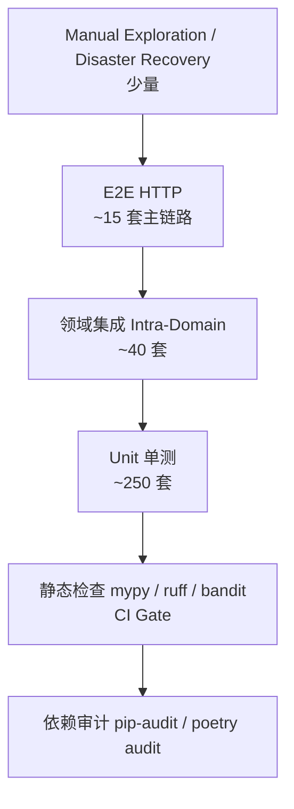

# OCAP 测试方案（Testing Plan）

> 测试分层：单测（Unit）→ 领域集成（Intra-Domain）→ 端到端（E2E / HTTP）→ 冒烟（Smoke）→ 非功能（性能/安全/合规）。
> 所有测试可在 macOS 12.7 单机上用 SQLite :memory: 跑通 100% 单测；集成测试用 SQLite/本地 PG 两者都兼容。

---

## 1. 测试金字塔与覆盖面



| 层 | 数量目标 | 耗时（本机） | 目标覆盖 |
| --- | --- | --- | --- |
| Unit 单测 | ≥ 250 | ≤ 90 s | 行覆盖 ≥ 80%，分支覆盖 ≥ 70% |
| 领域集成 | ≥ 40 | ≤ 60 s | 每个 BP ≥ 2-3 条主路径 |
| E2E HTTP | ≥ 10 | ≤ 180 s | 覆盖 9 个 BP 的主链路 |
| Smoke（真实 HTTP 部署后） | ≥ 20 | ≤ 60 s | 部署后校验 |
| 性能压测 | 4 场景 | 30 min | 见 [06-performance-capacity.md](./06-performance-capacity.md) 指标 |
| 合规与安全 | 8 项 | 60 min | 21CFR Part 11 签名链、RBAC、注入 |

---

## 2. 测试环境矩阵

| 环境 | DB | Redis | 集成模式 | 用途 |
| --- | --- | --- | --- | --- |
| LOCAL (dev) | SQLite :memory: + StaticPool | fakeredis (inproc) | MOCK（全本地） | 单测默认 |
| LOCAL-INTG | SQLite file / PG 本地 | 真实本地 6379 | MOCK | 集成测试 |
| MACOS-VAL | PG 15 Homebrew | Redis 7 Homebrew | MOCK（seed 打底） | 部署后冒烟 |
| PRE-PROD | 真实 PG 主从 | Redis 集群 | 真实三方（灰度） | UAT / 压测 |

---

## 3. 基础工具与 Fixture 设计

### 3.1 pytest 约定

```bash
poetry run pytest tests/ \
  --cov=app --cov-report=term-missing --cov-report=xml:coverage.xml \
  -n auto --dist loadscope -q
```
关键插件：`pytest-asyncio(Mode=auto)`、`pytest-cov`、`pytest-xdist`、`httpx`、`faker`、`hypothesis`。

### 3.2 核心 Fixture（`tests/conftest.py`）

| Fixture | Scope | 说明 |
| --- | --- | --- |
| `db_session` | function | AsyncSession，回滚式；SQLite 内存 |
| `seed_data` | module | 幂等加载 9 份 seed yaml：租户/用户/角色/权限/触发规则/模板/案例/集成mock/配置 |
| `app_test` | session | FastAPI TestApp（带依赖覆盖 get_db / get_redis / integrations→mock） |
| `authed_client` | function | httpx.AsyncClient，`ocap_role=engineer` JWT |
| `admin_client` | function | httpx.AsyncClient，`ocap_role=admin` JWT + 超管权限集 |
| `super_client` | function | httpx.AsyncClient，跨租户 super_admin |
| `mock_store` | session | 集成三方 FakeStore，单测前后 `reset()` |
| `freezer` | function | `freezegun` 控制时间，便于 SLA / 超时 / 保留期 |

### 3.3 打底 Seed 数据（macOS 12.7 验证必跑）

`app/db/seed/data/*.yaml`：
- `01_tenants.yaml`：fab_a + fab_b
- `02_roles_permissions.yaml`：admin/engineer/operator/supervisor/qa/super_admin，权限 60+ 条
- `03_users.yaml`：6 个用户 + PBKDF2 密码（开发环境统一 `Admin123!`）
- `04_trigger_rules.yaml`：8 条 SPC/FDC/MANUAL 规则
- `05_workflow_templates.yaml`：4 套 OCAP 模板（Thickness/Particle/CD/Overlay）
- `06_knowledge_cases.yaml`：20 条已发布历史案例，覆盖主要机台/工艺
- `07_integration_configs.yaml`：9 条 mock 端点配置
- `08_retention_configs.yaml`：保留策略 6 条
- `10_fake_store.yaml`：FakeStore B2026-001 ~ 005、YMS 良率、DMS 缺陷、Recipe

---

## 4. 单测覆盖点（Unit，共 ≥ 250 条）

| 模块 | 用例数（目标） | 必测场景 |
| --- | --- | --- |
| `app.core` (types/exceptions/security/pagination/hash) | 20 | JWT encode/decode；JSONBCompat SQLite/PG 往返；Pagination SQL 计算；密码 hash 校验；乐观锁冲突 |
| `app.db.seed` | 6 | 幂等重复加载；空库首次加载；跨 SQLite/PG；版本号推进 |
| BP-A Trigger/Event Service & API | 30 | 手动创建；SPC/FDC 订阅→去重→合并→状态机→闭环校验失败→闭环通过；SLA 升级计时 |
| BP-B Workflow 引擎 + API | 40 | 模板 publish/retire；实例启动；节点推进 3→4 步路径；乐观锁冲突重试；rollback/jump/terminate/cancel；超时扫描；BPMN-lite 编译异常 |
| BP-C RCA + CPM + API | 30 | 5Why / Fishbone / 8D 入库；CPM 加权打分（10 特征）；图谱路径推理；approve/reject；repeat 检测 |
| BP-D Action / 签名 / SLA / 处置 + API | 40 | 创建/指派/execute/rollback；4 眼签（不同人/同号拒绝）；签名 hash 链篡改→验证失败；SLA breach 计算；MES batch hold/release/scrap/rework；closure 100% 项 |
| BP-E Integration + Mock | 20 | 9 个 FakeClient 各 1 条正向 + 1 条异常；sync log 写；DQI issue；Idempotency |
| BP-F Knowledge + Graph + API | 20 | 草稿 / 审核退回 / 发布 / 退休；图谱实体/关系增删；最短路径 N=3,4；专家规则命中 |
| BP-G Analytics + API | 14 | KPI upsert 幂等（唯一键）；trend 聚合；Pareto 80/20；G2G 周期；8D 报告生成（含 RCA + Action） |
| BP-H Compliance + API | 16 | 审计链写入→verify 完整→删一行→verify 失败；电子记录导出；保留期计算；legal hold 覆盖；SPC spec 版本 |
| BP-I Platform + API | 14 | 登录成功/失败/过期；RBAC 权限 deny（403）；通知标已读；导出任务；config 回读；/healthz |

---

## 5. 集成测试（Intra-Domain, ≥ 40 条）

示例（伪代码）：
```
TC-INT-A-01 报警 → 事件 → 自动启动模板 → 实例 running
TC-INT-B-02 模板有并行网关分支 → 2 userTask 分别完成 → 汇聚到 end
TC-INT-C-03 RCA(5Why) 发布 → 自动创建 action（规则）
TC-INT-D-04 action execute → MES HOLD → 双签 → audit 链 8 条完整
TC-INT-E-05 外部 SPC 连续报警 → dedup_window 抑制 → count++
TC-INT-F-06 RCA 发布 → 自动沉淀为 knowledge case(draft) → 审核→发布
TC-INT-G-07 100 条事件写入 → kpi 聚合 → MTTR 与手写公式一致
TC-INT-H-08 跨租户查询：tenant-1 不能看到 tenant-2 的事件
TC-INT-I-09 SLA 到时（freezer +59min）→ notification；+61min → breach
TC-INT-X-10 并发 20 次推进同一 workflow 节点（乐观锁）→ 只有 1 次 200
```

---

## 6. E2E HTTP 测试（≥ 10 条，`tests/integration/test_e2e_lifecycle.py` 为核心）

已实现的 1 条全链路 `test_event_workflow_rca_action_analytics_chain`，覆盖 9 个 BP 的主链路，下面给出 **标准 E2E 清单**（建议补齐到 10 条）：

| ID | 场景 | 核心断言 |
| --- | --- | --- |
| E2E-01 | ✅ 手动创事件 → 启模板 → RCA 5Why 发布 → Action 执行 + 4 眼签 + MES hold/release → 闭环 → KPI/审计链 | 全链路 2xx；签名链完整；审计链 intact=true；8D 非空；KPI ≥1 |
| E2E-02 | 报警订阅（SPC 批量 100 条）→ dedup 压缩 30% → 自动创建工作流 N 个 | 事件数 < 100（去重生效）；实例 running ≥ 70 |
| E2E-03 | RCA-CPM 冷启动 → 先灌 20 案例（发布）→ CPM Top-1 命中率 ≥ 60% | Top-1 分数 ≥ 60，≥ 12/20 命中 |
| E2E-04 | 批并发处置 200 → MES hold → APC param tune → Recipe swap | 批次状态全部 held；3 域都有 sync log |
| E2E-05 | 干预：advance 一次 → rollback → jump 到 n3 → terminate | 最终 status=terminated；干预记录 ≥ 3 |
| E2E-06 | 权限：operator 只能读；engineer 可写；admin 可删；跨租户禁止 | 403 场景 ≥ 4 |
| E2E-07 | 审计链完整性：写入 100 条 → 删除第 50 条（测试用例直接 DB delete）→ /verify 失败 | intact=false, broken_at=50 |
| E2E-08 | 知识图谱：创 10 节点 + 20 边 → 路径检索（a→z, depth=4）→ 返回 ≥ 1 条 | 路径节点顺序正确 |
| E2E-09 | 月末 KPI 批量 → Pareto 维度=equipment_id → Top 项与手动 SQL 一致 | Pareto 结果误差 < 0.5% |
| E2E-10 | SLA：freezer 模拟 30+61min → 通知 2 条 + breach 1 条 | breach 非空；通知数=2 |

---

## 7. 非功能测试

### 7.1 性能压测（wrk / k6 / locust）

```
Scenario 1：POST /triggers/events（手动上报）
  - VU 50，持续 5 min
  - 目标：P95 ≤ 200 ms，错误率 < 0.1%，RPS ≥ 800（4 Uvicorn）

Scenario 2：POST /workflows/instances/{id}/advance
  - VU 20，持续 5 min（同一实例不同轮，控制版本冲突率 ≤ 10%）
  - 目标：P95 ≤ 2 s

Scenario 3：POST /rcas/cpm（Top-5 推荐，案例库 10,000 条）
  - VU 20，持续 5 min
  - 目标：P95 ≤ 500 ms

Scenario 4：混合真实生产比例（读 80% / 写 20%）
  - RPS ≥ 500 稳态；CPU ≤ 70%；内存 ≤ 70%
```

### 7.2 可靠性测试
- 进程级：`kill -9 app pid 5 次/min` → launchd 自动拉起，1 分钟内服务恢复
- DB 主从切换：模拟 PG 主宕机 → 从库升级 → 10 min 内写服务可用（生产集群）
- Redis 宕机 2 分钟 → API 返回 503 + 降级；Redis 恢复后自动复位
- 三方集成超时 + 5xx → 熔断器开启 30s → 半开；mock 全正常时 0 熔断

### 7.3 安全测试
- SAST：`bandit -r app -c pyproject.toml`（CI Gate）
- DAST：`OWASP ZAP` 对 E2E 登录态抓包跑基线
- 注入：用 `hypothesis` 随机生成特殊字符对所有 API 跑 fuzz（无 SQLi / XSS）
- 权限：`tests/integration/test_rbac_matrix.py`（用户 × 资源 × 动作 = 预期 403/2xx）
- 敏感数据：`credentials` / `password_hash` / JWT 私钥绝不出现在日志；用自定义 `logging.Filter` 屏蔽关键字段

### 7.4 合规性测试（21 CFR Part 11）
| ID | 测试点 | 通过标准 |
| --- | --- | --- |
| CFR-01 | 签名不可复用同一用户两次 | 409 CONFLICT + 消息明确 |
| CFR-02 | 签名链 hash 截断 1 字节 → verify 失败 | `intact=false` + broken_at 精准定位 |
| CFR-03 | 审计链删除中间记录 → verify 失败 | 同上 |
| CFR-04 | 修改 DB `after` 内容不改 hash → verify 失败 | 失败 |
| CFR-05 | 合法持有期间禁止归档删除 | 删除时 409 |
| CFR-06 | 签名 meaning / 时间 / 人 / 动作 四要素持久完整 | 查询 API 字段齐全 |
| CFR-07 | 系统时间回拨 10 秒（freezer）→ 签名顺序单调校验 | 时间倒退拒绝签名 |
| CFR-08 | 电子记录导出自包含 hash；独立离线工具可核验 | 独立脚本验证通过 |

---

## 8. macOS 12.7 验证必跑清单（Baseline）

部署完成后执行：
```bash
# 1）基础依赖检查（单元 + 集成全量，SQLite 内存，无外部依赖）
cd /opt/ocap/app && source .venv/bin/activate
pytest tests/unit tests/integration -q --no-cov
# 期望：全部通过（≥ 188 tests，含 2 integration）

# 2）打底数据量验证（FakeStore + 知识）
python -m app.scripts.check_seed --tenant fab_a
# 期望：
#   events(seed) + trigger_rules ≥ 8
#   published knowledge_cases ≥ 20
#   batches ≥ 5

# 3）部署后冒烟（HTTPS 真接口）
pytest tests/smoke -q --base-url https://localhost:8443 -v

# 4）审计链完整性自检（首次部署空链也必须 intact=true）
curl -k -H "Authorization: Bearer $ADMIN_TOKEN" "https://localhost:8443/api/v1/compliance/audits/verify?limit=500"
# {"intact": true, ...}
```

---

## 9. CI/CD Gate 准入条件

- ✅ `ruff check app tests` 0 错误 + 0 warning
- ✅ `mypy app tests --strict` 0 错误（可逐步提高严格度）
- ✅ `bandit -r app` 0 critical / 0 high
- ✅ `poetry audit` 0 high / 0 critical CVE
- ✅ 单测 `pytest tests/unit` 100% 通过，行覆盖 ≥ 80%
- ✅ 集成 `pytest tests/integration` 100% 通过
- ✅ 性能基线脚本（3 场景）不低于上次基线 5%
- ✅ 合规测试 CFR-01…08 全部通过

---

## 10. 缺陷等级与响应 SLA

| 等级 | 定义 | 响应 | 修复 | 示例 |
| --- | --- | --- | --- | --- |
| P0 Critical | 数据丢失 / 审计链断 / 批次误处置 / 越权 | 15 分钟 | 2 小时 | audit verify 失败；MES release 了不该放的批 |
| P1 High | 主流程不可用、性能劣化 2x | 1 小时 | 24 小时 | workflow advance 永远 409 |
| P2 Medium | 非关键 UI/文案，次流程 bug | 4 小时 | 5 工作日 | 分页 page=0 边界错 |
| P3 Low | 优化建议 / 非关键日志噪声 | 1 工作日 | 下个版本 | metric_samples 说明错字 |
